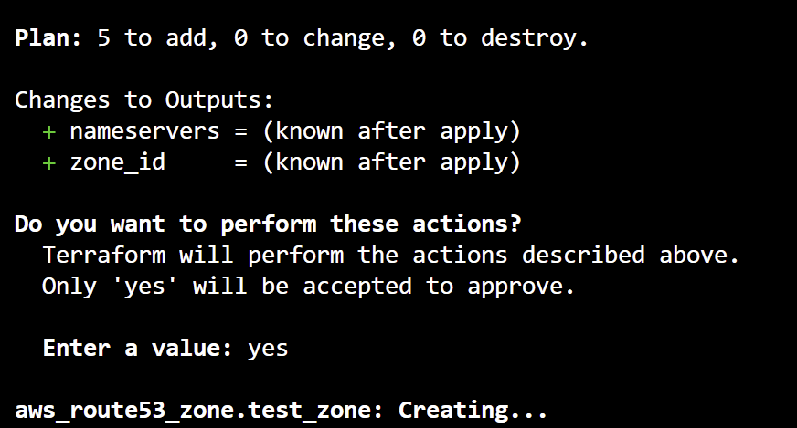

# 주제

**Terraform을 이용한 AWS 인프라 자동화 – Route 53 실습**

---

# 요약

* Terraform은 인프라를 코드로 관리하는 IaC(Infrastructure as Code) 도구로,
  코드 작성 → 계획(plan) → 반영(apply) 세 단계로 인프라를 자동 구성한다.
* Route 53은 AWS의 DNS 서비스로, 도메인 등록과 트래픽 라우팅 정책을 코드로 정의하고 자동화할 수 있다.
* 본 실습에서는 Terraform을 이용해 Route 53 Hosted Zone과 Record(A, CNAME, Weighted Routing)를 구성하였다.

---

# 학습 내용

## Terraform 작동 방식

테라폼은 **코드 작성**, **플래닝**, **반영**의 세 단계 workflow를 따른다.

### 테라폼 프로젝트 구조

* **구성 파일 (configuration file)**
  인프라 구성 의도를 코드로 작성한다.

  * 어떤 인프라 리소스가 provisioning 되어야 하는지
  * 각 리소스는 어떤 설정값을 가져야 하는지를 선언한다.

`terraform init`으로 초기화하면 루트 모듈(현재 디렉터리)이 실행 환경이 된다.
이때 `.terraform` 디렉터리가 생성되어 프로바이더, 모듈 등의 실행 구성이 저장된다.

루트 모듈에서 상태 동기화 명령(플래닝, 반영)을 실행하면
Terraform은 코드에 정의된 리소스에 따른 실제 인프라 리소스를 읽어
JSON 형식의 **상태 파일(state file)** 로 저장한다.
이 파일이 Terraform의 내부 “현재 상태 데이터베이스” 역할을 한다.

---

### 테라폼 상태 (Terraform State)

Terraform은 코드로 기대 상태를 선언하고, 명령 실행을 통해 실제 인프라 상태를 읽는다.
**Terraform state의 목적:**

> 코드에 정의된 리소스와 실제 인프라 리소스를 매핑해 관리하는 것.

#### 주요 개념

* **리소스 드리프트 (Resource Drift)**
  Terraform 외부(콘솔 등)에서 리소스가 임의 변경되면 코드와 실제 상태가 불일치하게 된다.
  → 다음 apply 시 Terraform은 “기대 상태와 다르다”고 판단하여 해당 리소스를 삭제 후 재생성한다.
  → 이는 예기치 않은 장애로 이어질 수 있다.
  → 따라서 상태 파일을 기준으로 인프라를 추적·관리해야 한다.

* **리소스 매핑**

  * Terraform은 실제 리소스의 고유 식별자(ID)와 구성 파일 리소스를 연결한다.
  * 예:

    ```bash
    terraform import aws_instance.example i-12345678
    ```

    → `aws_instance.example` 코드와 실제 인스턴스 `i-12345678`을 매핑한다.

* **의존성 관리**

  * Terraform은 리소스 간 의존성을 인식해 생성/삭제 순서를 자동 계산한다.
  * 명시적 참조(`depends_on`)와 암시적 참조(리소스 내 변수 참조) 두 가지 방식을 지원한다.

---

### 테라폼 명령과 작동

| 구분         | 명령                                                                                                             | 설명                              |
| ---------- | -------------------------------------------------------------------------------------------------------------- | ------------------------------- |
| **상태 동기화** | `terraform refresh`, `terraform apply -refresh-only`                                                           | 실제 인프라 상태를 state 파일에 반영         |
| **플래닝**    | `terraform plan`                                                                                               | 코드의 기대 상태와 실제 상태를 비교해 변경 사항을 계산 |
| **반영**     | `terraform apply`, `terraform destroy`                                                                         | 계획(plan)된 변경을 실제 인프라에 적용        |
| **상태 명령**  | `terraform state list`, `terraform state show`, `terraform state mv`, `terraform state rm`, `terraform import` | 상태 파일의 리소스 확인, 이동, 삭제, 매핑 등 조작  |

---

### 명령 사용 예시

#### 상태 동기화

```bash
terraform refresh
```

현재 인프라 상태를 읽어 state 파일을 최신화한다.

#### 플래닝

```bash
terraform plan
```

변경 없이 어떤 리소스가 생성/변경/삭제될지 미리 계산한다.

#### 반영

```bash
terraform apply
terraform destroy
terraform plan -destroy
```

실제 인프라에 변경 사항을 반영한다.

#### 상태 관리

```bash
terraform state list
terraform state show
terraform import aws_instance.example i-12345678
```

리소스 주소와 실제 인프라 리소스 식별자를 매핑해 Terraform 상태를 갱신한다.

---
### 기본 문법

#### count 반복문
```hcl
// 리소스를 여러 번 생성하기 위한 count 반복
// count 만큼 리소스 반복 생성 
// 네임태그와 프라이빗 ip에 값 명시
// 순서 취약, 각각 넘기지 않고 count 통으로 넘겨서 장애 유발 위험

resource "aws_instance" "this" {
  count         = 3
  ami           = "ami-0123456789"
  instance_type = "t3.medium"

  private_ip = "10.0.0.${count.index + 1}"

  tags = {
    Name = "EC2-${count.index + 1}"
  }
}
````


### for_each 반복문

```hcl
// map이나 set을 매개변수로 받아서 데이터 순회하면서 리소스 생성
// for_each 반복
resource "aws_instance" "this" {
  for_each = {
    windows = {
      ami  = "ami-0123456789"
      type = "t3.medium"
    }
    linux = {
      ami  = "ami-9876543210"
      type = "r5.2xlarge"
    }
  }

  # 인스턴스별 설정
  ami           = each.value.ami
  instance_type = each.value.type

  # 공통 설정
  subnet_id              = "subnet-123456"
  vpc_security_group_ids = ["sg-123123123"]

  tags = {
    Name = each.key
  }
}
```


#### 삼항 연산자

```hcl
// 삼항 연산자
variable "is_production" {
  type    = bool
  default = false
}

resource "aws_instance" "this" {
  ami           = "ami-123455"
  instance_type = var.is_production ? "m5.xlarge" : "t3.medium"
}
```


#### 중첩 삼항 연산자 (환경별 설정)

```hcl
// 환경이 production인지 검사
variable "env" {
  type    = string
  default = "develop"
}

resource "aws_instance" "this" {
  ami           = "ami-123455"
  instance_type = var.env == "production" ? "m5.xlarge" :
                  var.env == "staging"    ? "m5.large"  : "t3.medium"
}
```


#### 조건부 리소스 생성 (count 활용)

```hcl
// 리소스 생성 여부 결정 시 count로 조건문 생성
variable "env" {
  type    = string
  default = "develop"
}

resource "aws_instance" "nginx" {
  count         = var.env == "production" ? 1 : 0
  ami           = "ami-123455"
  instance_type = "t3.medium"
}
```


#### map 정의 및 필터링

```hcl
// 맵 정의
server_map = {
  ad_server = {
    active    = true
    is_window = true
  }
  squid_proxy = {
    active    = false
    is_window = false
  }
  web_server = {
    active    = true
    is_window = false
  }
}

// 활성 상태인 키 이름만 추출
active_server = [
  for k, v in local.server_map : k
  if v.active
]
```

#### provider 블록

```hcl
// 프로바이더 블록 
provider "aws" {
  region  = "ap-northeast-2"
  profile = "terraform"

  assume_role {
    role_arn = "arn:aws:iam:${account_id}:role/AssumeRole"
  }
}

# 추가 프로바이더
provider "aws" {
  region  = "ap-northeast-2"
  profile = "terraform-b"

  alias = "terraform-b"
}
```

#### 데이터 블록 / 출력 블록

```hcl
// 리소스 블록
// 데이터 블록: 데이터를 읽어오는 용도
data "aws_region" "current" {}

output "region_name" {
  value = data.aws_region.current
}

// 모듈 블록 
// 변수 블록
// 로컬 블록
// 출력 블록: 테라폼 코드 실행 결과 솎아내기
output "output_name" {
  value = <value>
}
```

```
```

---

# 추가

## Amazon Route 53

Route 53은 AWS의 관리형 **DNS 서비스**로,
도메인 등록과 트래픽 라우팅, 장애 조치(Failover) 등의 기능을 제공한다.

* **도메인(Zone) 생성:** `aws_route53_zone`
* **DNS 레코드 등록:** `aws_route53_record`
* **가중치 기반 라우팅(Weighted Routing):** 트래픽을 여러 리소스로 비율 분배
* **인증서 관리:** SSL 인증서 검증 등
  → Terraform으로 이러한 Route 53 작업을 자동화하면, 인프라 변경 내역 추적 및 반복 배포가 가능해진다.

---

### Terraform Plan 결과 예시

```bash
>> terraform plan

Terraform used the selected providers to generate the following execution  
plan. Resource actions are indicated with the following symbols:
  + create

Terraform will perform the following actions:

  # aws_route53_record.a_record will be created
  + resource "aws_route53_record" "a_record" {
      + allow_overwrite = (known after apply)
      + fqdn            = (known after apply)
      + id              = (known after apply)
      + name            = "www.example.local"
      + records         = [
          + "192.168.0.100",
        ]
      + ttl             = 300
      + type            = "A"
      + zone_id         = (known after apply)
    }

  # aws_route53_record.blue will be created
  + resource "aws_route53_record" "blue" {
      + allow_overwrite = (known after apply)
      + fqdn            = (known after apply)
      + id              = (known after apply)
      + name            = "app.example.local"
      + records         = [
          + "10.0.1.10",
        ]
      + set_identifier  = "blue"
      + ttl             = 300
      + type            = "A"
      + zone_id         = (known after apply)

      + weighted_routing_policy {
          + weight = 80
        }
    }

  # aws_route53_record.cname_record will be created
  + resource "aws_route53_record" "cname_record" {
      + allow_overwrite = (known after apply)
      + fqdn            = (known after apply)
      + id              = (known after apply)
      + name            = "api.example.local"
      + records         = [
          + "www.example.local",
        ]
      + ttl             = 300
      + type            = "CNAME"
      + zone_id         = (known after apply)
    }

  # aws_route53_record.green will be created
  + resource "aws_route53_record" "green" {
      + allow_overwrite = (known after apply)
      + fqdn            = (known after apply)
      + id              = (known after apply)
      + name            = "app.example.local"
      + records         = [
          + "10.0.1.20",
        ]
      + set_identifier  = "green"
      + ttl             = 300
      + type            = "A"
      + zone_id         = (known after apply)

      + weighted_routing_policy {
          + weight = 20
        }
    }

  # aws_route53_zone.test_zone will be created
  + resource "aws_route53_zone" "test_zone" {
      + arn                 = (known after apply)
      + comment             = "Local Route53 test zone"
      + force_destroy       = false
      + id                  = (known after apply)
      + name                = "example.local"
      + name_servers        = (known after apply)
      + primary_name_server = (known after apply)
      + tags_all            = (known after apply)
      + zone_id             = (known after apply)
    }

Plan: 5 to add, 0 to change, 0 to destroy.

Changes to Outputs:
  + nameservers = (known after apply)
  + zone_id     = (known after apply)
```

`terraform apply` 실행 시 위 계획(plan) 그대로 리소스가 실제로 생성된다.



