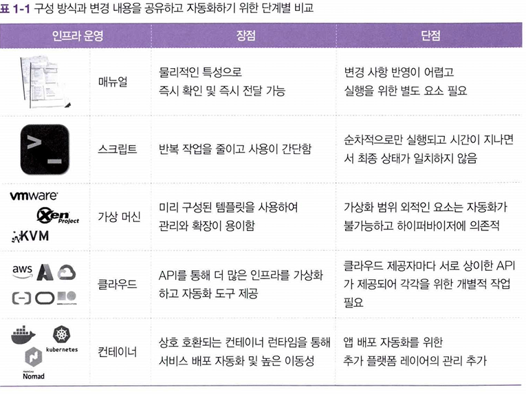

# [Chapter 1] IaC와 테라폼

사용자가 원하는 대상의 자원 생성과 관리를 사용자 방식에 맞춘다. - 특정 환경에 구애받지 않는다.

코드 기반으로 재활용성을 확보하고 사용자 간 협업을 이끌어낸다.

인프라 변경 내용 공유 및 자동화 방식 변화 과정

매뉴얼 수기 작성 → 스크립트 → 미리 구성한 가상 머신 템플릿 → 
클라우드 인프라 (자동화 api 제공) → 컨테이너 (OS 가상화) 

- 자동화는 각 프로세스 작업을 통합하고 재활용성을 높이는 것이 중요하다.
- 기존의 자동화는 특정 환경에서만 동작하는 개별 맞춤형으로 구성됐어서, 추상화된 리소스를 다룰 때는 기존 자동화를 재적용하는 데 어려움이 있었다.

→ 분산 시스템과 MSA와 같이 작은 규모로 독립성을 유지할 수 있어야 하고, 주기적 변경 사항에도 적응할 수 있으려면 프로세스적인 방법이 필요하다. (코드적 표현 방식의 자동화)

- 워크플로, 표준화
- 환경을 이해
- 반복적으로 동일한 상황 재연출 가능 
(버전 관리툴과 연계 가능, 재사용성, 기술의 자산화)

- Terraform 코드 문법을 학습해야하고, 대상 인프라에 대한 이해가 필요

각 인프라와 서비스는 고유의 api를 가지고 있고,
 프로바이더는 각 api 명세를 테라폼 코드로 호출하여 동작한다.

테라폼은 다양한 프로바이더와 조합할 수 있다 ㅡ 다중 클라우드 및 하이브리드 인프라

| 구분 | Terraform | Ansible | CloudFormation |
| --- | --- | --- | --- |
| **역할** | 인프라 생성(IaC) | 서버 설정·배포 | AWS 인프라 생성 |
| **방식** | 선언적(HCL) | 절차적(YAML) | 선언적(YAML/JSON) |
| **대상** | 멀티클라우드 | 멀티 + 온프레 | AWS 전용 |
| **상태관리** | state 파일로 추적 | 없음(멱등성) | 스택 단위 관리 |
| **강점** | 범용성, 재사용 | 구성 자동화 쉬움 | AWS 통합성 최고 |
| **약점** | state 관리 부담 | 장기 추적 어려움 | AWS 외 불가 |